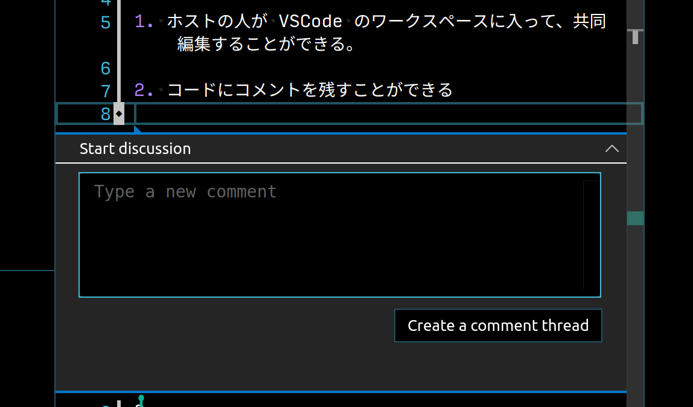
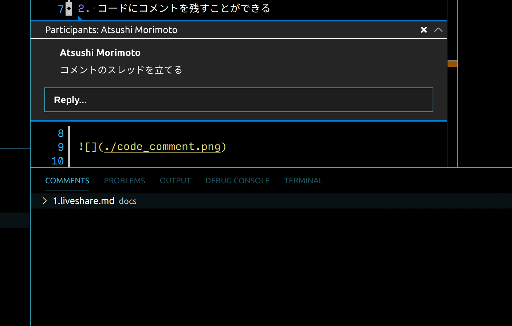
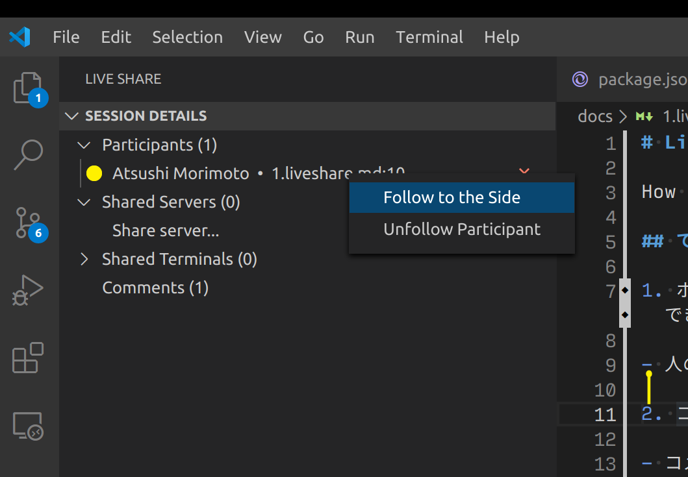
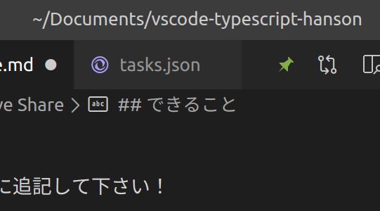
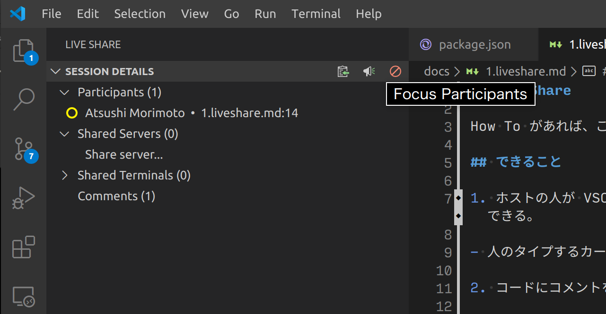
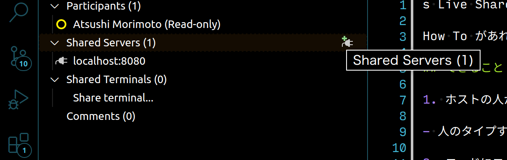

# Live Share

How To があれば、ここに追記して下さい！

## できること

1. ホストの人が VSCode のワークスペースに入って、共同編集することができる。

- 人のタイプするカーソルを見ることができる

2. コードにコメントを付ける

- コメントの一覧がパネルに表示される
- コメントにはリプライができる





注意: スレッドに表示される右上の ✕ ボタンは**削除**のボタンです。

3. 人のカーソルを追いかけることができる



追いかけるモード中は、エディター右上のピンの色が変わります。



4. 自分のカーソルを追いかけさせることができる



5. ポートを共有できる（Share Server から）



6. Debug Session を共有できる
7. ターミナルを共有できる
8. 音声共有ができる
9. 細かい権限設定ができる

- 他の人を呼ぶことを許可する
- Terminal の実行許可
- Task、Debug の設定編集、実行許可

## 注意すること

- Task、Terminal、Debug の設定を不用意に開放しない
- 共有リンクを信頼の置ける人にだけ共有する

## Share を始める

- (1) (1 度だけ) コマンド "Microsoft Account: Sign on" を実行し、Microsoft アカウントと連携する
- (2) コマンド "Live Share: Start Collaborate Session (Share)" を実行
- (3) Clip Board にリンクがコピーされるので、このリンクを共有する

## 人のセッションに入る

- (1) 共有されたリンクをクリックする

or

- (1) コマンド "Live Share: Join Collaboration Session" を実行
- (2) 共有されたリンクをペーストする

## 今日の進め方

コーディングはなるべく Live Share 環境で行って下さい。

デバッグが Live Share 環境では実行できないため、リモート SSH 機能を使って以下のサーバにログインして下さい。

コマンド "Remote-SSH: Open Configuration File..." で .ssh/config を開き、以下のように入力をして下さい。
IdentityFile は Slack で共有したファイルを指定して下さい。

For MacOS / Linux

```
HOST handson
  HostName 52.185.173.228
  User ubuntu
  IdentityFile /home/nnyn/Downloads/hanson_key
```

For Windows

```
Host handson
    HostName 52.185.173.228
    User ubuntu
    IdentityFile "C:\Users\nnyn\Downloads\hanson_key"
```

コマンド "Remote-SSH: Connect to Host..." を実行し、"handson"を選んで下さい。

最初はフォルダーが開かれていない状態になっています。コマンド "File: Open Folder..."を実行し、`/home/ubuntu/main/`を開いて下さい。
