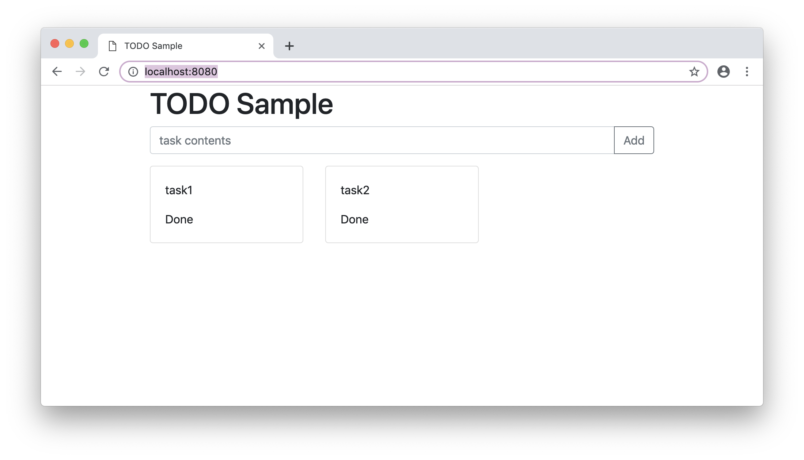

# Type Script のコンパイルとユニットテスト

## タスク管理アプリ

『Visual Studio Code 実践ガイド』より




## コードの構成

```
todo-list
|-- src                 ……TypeScriptのコード
|   |-- model           ……フロントエンド、Web APIで共通のモデル
|   |-- server          ……Web API
|   |-- frontend        ……フロントエンド
|   `-- tests           ……TypeScriptのユニットテスト
|      `-- model        ……モデルのテストコード
|-- out                 ……TypeScriptの出力
|-- public
|   `-- html
|       |-- js          ……Webpackの出力先
|       `-- index.html  ……ドキュメントルート
`-- node_modules        ……利用するnpmパッケージの格納フォルダー（自動生成）
```

## 設定ファイル類

- package.json : npm package
- tsconfig.json : Type Script の設定
- webpack.config.js : webpack の設定
- tslint.json : webpack の設定
- .vscode/settings.json : プロジェクトの設定ファイル
- .vscode/launch.json : デバッグ実行定義
- .vscode/tasks.json : タスク設定

## Type Script をコンパイルする

コマンドなら

```
./node_modules/.bin/tsc
```

[VS Code Task](../.vscode/tasks.json)なら

```json
{
  "version": "2.0.0",
  "tasks": [
    {
      "type": "typescript",
      "label": "tsc build",
      "tsconfig": "tsconfig.json",
      "problemMatcher": ["$tsc"]
    }
  ]
}
```

[バックグランド実行のタスク](../.vscode/tasks.json)

```json
{
  "version": "2.0.0",
  "tasks": [
    {
      "type": "typescript",
      "label": "tsc watch",
      "tsconfig": "tsconfig.json",
      "problemMatcher": ["$tsc"]
    }
  ]
}
```

## ロジックの実装

課題 1 タスクを完了にする関数を実装してみて下さい。

タスクのリストは`Repository.tasks`に格納されていて、`ITask.done`プロパティにタスクが完了したかどうかのフラグを持っています。

- ITask [src/model/task/morimoto_task.ts](../src/model/task/morimoto_task.ts)
- Repository [src/model/task/morimoto_repository.ts](../src/model/task/morimoto_repository.ts)
  - DoneTask

## ユニットテスト

ユニットテストフレームワーク[mocha](https://mochajs.org/)を使います。

[tests/model/task/morimoto_repository_test.ts](../tests/model/task/morimoto_repository_test.ts)

コマンドなら

```
NODE_PATH=./ ./node_modules/.bin/mocha -r ts-node/register tests/model/task/repository_test.ts
```

だいたいの Nodejs のツールが絡んでいても、`-r ts-node/register`を使うと TypeScript のまま引数に渡せて便利。

課題 2 CodeLens を使って実行、及びデバッグ実行してみて下さい。TypeScript がデバッグできることを確認して下さい。

課題 3 Test Explorer タブ を使って、実行、及びデバッグ実行してみて下さい。

[tsconfig.json](../tsconfig.json#L22) `"sourceMap": true`が有効になっていると、xxx.js.map ファイルが作られ、それをもとに Type Script を Java Script のようにデバッグできます。

[mocha 周りの設定](../.vscode/settings.json#L35)

```json
{
  // --- mocha の設定 ---
  // Mochaはnode_modules内のパッケージを使う
  "mochaExplorer.mochaPath": "./node_modules/mocha",

  // testsフォルダー下のソースコードを指定する
  "mochaExplorer.files": "tests/**/*.ts",

  // TypeScriptを使うため、ts-nodeを使う
  "mochaExplorer.require": ["ts-node/register"],

  // ワークスペースのフォルダーで実行する
  "mochaExplorer.cwd": "./",

  // ワークスペース内のファイルで絶対参照を使うための設定
  "mochaExplorer.env": {
    "NODE_PATH": "./"
  }
}
```
