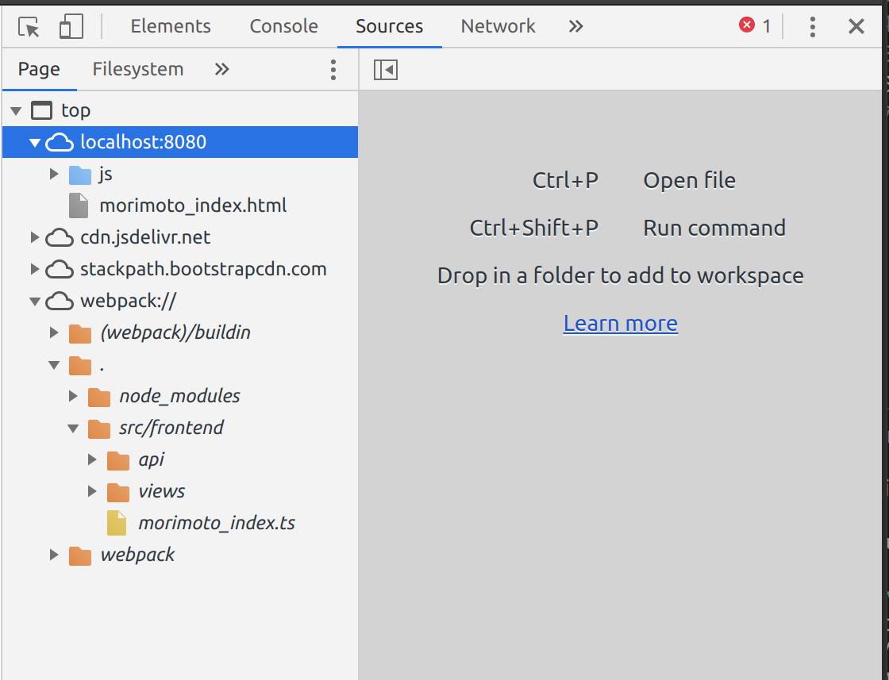

# 4. Frontend のデバッグ

## コードの構成

```
|- src
|  `- frontend
|    |- morimoto_index.ts : エントリーポイント
|    |- api
|    |  `- morimoto_task.ts : REST APIにアクセスする
|    `- views/ Vue.jsオブジェクト
|       |- morimoto_newTask.ts : タスク作成UI
|       `- morimoto_taskList.ts : タスク一覧と、タスクカード
`- public
   `- html
      |- js
      |  `- morimoto_index.js : webpackで生成したJS
      `- morimoto_index.html : HTML
```

## webpack

webpack を使うと、commonjs 形式のモジュール（NodeJS で使われている）を、Web Browser でも実行できるように、依存関係を 1 つのソースコードにまとめてくれます。
設定ファイルは[webpack.config.js](../webpack.config.js)で、Type Script のコンパイルを行わせるようにしています。

```
./node_modules/.bin/webpack src/frontend/ ./src/frontend/morimoto_index.ts --output ./public/html/js/morimoto_index.js
```

Task 化すると、以下のようになります。

```json
{
  "version": "2.0.0",
  "tasks": [
    {
      "label": "morimoto webpack build",
      "command": ["${workspaceFolder}/node_modules/.bin/webpack"],
      "args": [
        "./src/frontend/morimoto_index.ts",
        "--output",
        "./public/html/js/morimoto_index.js"
      ],
      "type": "shell",
      "group": {
        "kind": "build",
        "isDefault": true
      },
      "problemMatcher": ["$tsc"]
    }
  ]
}
```

また、バックグラウンドプロセスでファイルの変更を検知し、自動でビルドする`webpack -w`というオプションがあります。
これを用いて Task 化し、

```json
{
  "version": "2.0.0",
  "tasks": [
    {
      "label": "webpack build (watch)",
      "command": ["${workspaceFolder}/node_modules/.bin/webpack"],
      "args": [
        "-w",
        "./src/frontend/morimoto_index.ts",
        "--output",
        "./public/html/js/morimoto_index.js"
      ],
      "type": "shell",
      "problemMatcher": ["$tsc"],
      "isBackground": true,
      "runOptions": {
        "runOn": "folderOpen"
      }
    }
  ]
}
```

`"runOptions"."runOn": "folderOpen"`を設定すると、ワークスペースを開いた時に自動で実行させることができます。

## デバッグ実行

前の節で構成した server を起動し、`http://localhost:8080/morimoto_index.html`にアクセスすると、フロントエンドを含んだページを表示できます。

リモート開発機能では、`Forward a Port`コマンドでサーバで起動したポートをローカルにつなぐことができ、手元の Web ブラウザで起動して確認することができます。

Debugger For Chrome の拡張機能を使うことで、Chrome ブラウザを通してフロントエンドをデバッグすることができます。
リモート開発機能と Debugger For Chrome の組み合わせでは、ポートフォワードした後にデバッグを開始すると、フロントエンドのコードをデバッグできます。

まず、Chrome の Developer Tools を開くと、Chrome はファイルをどのように認識しているか確認することができます。



webpack://./src/frontend/morimoto_index.ts というパスが見て取れると思います。

VSCode で Chrome をデバッグするには、この sourceMapPathOverrides というパラメータで、Chrome のパスと、VSCode のパスの対応を作ります。

```json
{
  "version": "0.2.0",
  "configurations": [
    {
      "type": "chrome",
      "request": "launch",
      "name": "morimoto Launch Chrome",
      "url": "http://localhost:8080",
      "webRoot": "${workspaceFolder}/public/html",
      "preLaunchTask": "morimoto webpack build",
      "sourceMapPathOverrides": {
        "webpack:///./src/*": "${workspaceRoot}/src/*"
      },
      "sourceMaps": true
    }
  ]
}
```

次に、**Chrome の Dev Tools を閉じて下さい（開いたままでは VSCode であタッチできない制約があります）**。

課題 6 タスクの Done ボタンを押した時の、API へのアクセスの動作を[src/frontend/api/morimoto_task.ts#L29](../src/frontend/api/morimoto_task.ts#L29)に実装してみて下さい。

課題 7 上記のコード中にブレイクポイントを置き、デバッグ実行してみて下さい。
